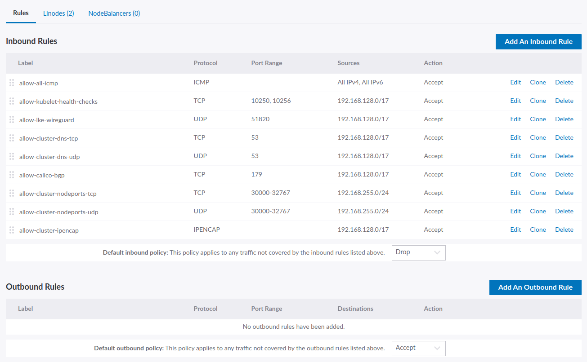

# cloud-firewall-controller
Controller for minimum cluster Cloud Firewall policies. The intention is to use this to setup the minimum security boundary for an LKE cluster.

## Installation
### Dependecies
The installation process will require the following command line tools be available on your system.
 - [helm](https://helm.sh/docs/intro/install/)
 - [kubectl](https://kubernetes.io/docs/tasks/tools/#kubectl)

Installation via [helm](https://helm.sh/docs/intro/install/) can be achieved in two ways, either through checking out the appropriate code version locally, or through the helm repository. Either option will result in the same objects being installed into the appropriate locations in an LKE cluster.

#### Local Checkout
```sh
git clone git@bits.linode.com:hwagner/cloud-firewall-controller.git
cd cloud-firewall-controller 
# (optional) git checkout <tag> 

export KUBECONFIG=<kubeconfig-path> 
helm upgrade --install cloud-firewall-crd helm/crd \
&& kubectl wait --for condition=established --timeout=60s crd/cloudfirewalls.networking.linode.com \
&& helm upgrade --install cloud-firewall helm/controller
```
  
#### Helm Repo
Note that the version in the helm commands is the helm chart version, not the application version.

##### Add the cloud-firewall-controller repo
```sh
helm repo add linode-cfw https://linode.github.io/cloud-firewall-controller
helm repo update linode-cfw
```

##### Install the CRDs and Controller
```sh
export KUBECONFIG=<kubeconfig-path> 
helm install cloud-firewall-crd linode-cfw/cloud-firewall-crd \
&& kubectl wait --for condition=established --timeout=60s crd/cloudfirewalls.networking.linode.com \
&& helm install cloud-firewall-ctrl linode-cfw/cloud-firewall-controller
```

##### Uninstall
```sh
export KUBECONFIG=<kubeconfig-path> 
helm delete cloud-firewall-controller
helm delete cloud-firewall-crd
```

## Results
The output from the controller is pretty striaghtforward, it will generate a Cloud Firewall with a label matching the pattern `lke-<cluster-id>` and have the following policies:

